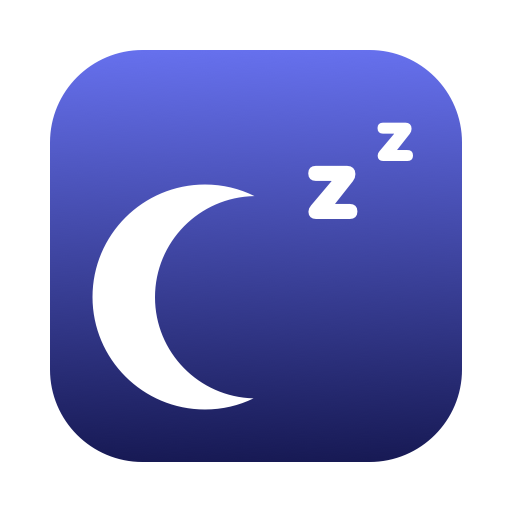

<div align="center">



# SleepSwitch

**Один клик в строке меню — и MacBook перестаёт засыпать, в том числе с закрытой крышкой.**

[](https://github.com/AppsGanin/SleepSwitch/releases/latest)
[](https://github.com/AppsGanin/SleepSwitch/actions)
[](https://github.com/AppsGanin/SleepSwitch/releases)
[](#требования)
[](LICENSE)

[English version](README.md)

</div>

---

`caffeinate` держит Mac бодрым ровно до закрытия крышки — дальше он всё равно засыпает,
потому что сон по крышке это отдельная настройка, спрятанная за `sudo`. SleepSwitch
переключает обе сразу, одной иконкой в строке меню.

Пригождается, когда надо закрыть ноутбук, но оставить работать сборку, закачку, рендер или
SSH-сессию — без внешнего монитора, без заглушки в HDMI и без приоткрытой крышки.

## Что умеет

- **Не спит при закрытой крышке.** Захлопнули — продолжает работать.
- **Не спит по бездействию.** Пока режим включён, таймер сна игнорируется.
- **Не гасит экран**, пока режим включён — отдельной настройки нет и думать не о чем.
- **Пароль спрашивается один раз.** Установщик ставит узкое правило `sudo`, дальше
  переключение идёт без запросов.
- **Ничего не остаётся висеть.** Выйдете из приложения или прибьёте его — запрет сна снимется сам.
- **Обновляется с GitHub** — проверяет раз в сутки, отдаёт установщик и никогда не подменяет
  бинарники втихаря.
- **Русский и английский**, и приложение, и установщик, по языку системы.
- **Два файла Swift**, без зависимостей, без фонового демона, без телеметрии.
- **Universal binary**, Apple Silicon и Intel.

## Установка

Скачайте `.pkg` из [последнего релиза](https://github.com/AppsGanin/SleepSwitch/releases/latest)
и откройте.

> [!NOTE]
> Приложение не подписано сертификатом Apple, поэтому первый раз macOS откажется его
> открывать. Правой кнопкой по файлу → **«Открыть»** → в диалоге ещё раз **«Открыть»**.
> Один раз.

Установщик кладёт приложение в `/Applications`, запускает его и — если не снять галочку
на шаге «Настроить» — ставит правило `sudo` для переключения без пароля.

## Управление

| Действие | Результат |
| --- | --- |
| **Левый клик** по иконке | Включить или выключить режим |
| **Правый клик** | Меню: автозапуск, вход в систему, обновления, правило `sudo` |

Иконка и есть индикатор:

| Значок | Что означает |
| --- | --- |
| 🌙 | Обычный режим — Mac засыпает как настроено |
| ☕️ | Режим включён — сон полностью запрещён |
| ⚠️ | Частично — сон по бездействию запрещён, но крышка усыпит |

## Как устроено

Два независимых слоя, потому что macOS считает это разными вещами:

| Слой | Что запрещает | Нужен root |
| --- | --- | --- |
| `pmset -a disablesleep 1` | Сон по крышке и вообще любой сон | Да |
| Ассершен `PreventUserIdleSystemSleep` | Сон по бездействию | Нет |
| Ассершен `PreventUserIdleDisplaySleep` | Гашение экрана | Нет |

Ассершены держит сам процесс, поэтому они исчезают вместе с ним — залипнуть не могут.
Настройка `pmset` живёт дольше процесса, поэтому приложение снимает её при выходе и по
`SIGTERM`, а при запуске показывает реальное положение дел, читая `SleepDisabled` прямо
из `IOPMrootDomain`.

## Про правило sudo

`pmset disablesleep` требует root. Спрашивать пароль на каждое переключение невозможно,
поэтому установщик пишет `/etc/sudoers.d/sleepswitch`:

```
вы ALL=(root) NOPASSWD: /usr/bin/pmset -a disablesleep 0
вы ALL=(root) NOPASSWD: /usr/bin/pmset -a disablesleep 1
```

Две команды, без шаблонов. `sudo` сверяет аргументы точно, так что правило даёт ровно
одну возможность — переключить настройку сна. `pmset -a sleep 0` по-прежнему просит пароль.

Файл готовится, проверяется через `visudo` и ставится целиком под root во временной папке
с правами `0700` — подменить его между проверкой и установкой некому. Имя учётной записи
проверяется до подстановки в `sudoers`, и правило выдаётся только администратору.

Отказаться можно на шаге установки, потом через меню — или руками:

```bash
sudo rm /etc/sudoers.d/sleepswitch
```

## Обновления

Раз в сутки приложение спрашивает у GitHub, нет ли релиза новее. Если есть — показывает
окно с тремя вариантами: скачать, посмотреть что нового, отложить. Проверку можно выключить
в меню: тогда в сеть ничего не уходит, пока вы сами не попросите.

Себя приложение не подменяет. Оно скачивает `.pkg` из релиза и открывает его системным
установщиком — обновление проходит ту же авторизацию, что и первая установка. Запросы
разрешены только по `https` и только на хосты GitHub, включая промежуточные редиректы;
всё остальное отклоняется.

## Блокировка экрана

Сон и блокировка экрана — разные настройки macOS, SleepSwitch трогает только сон. Если при
открытии крышки Mac просит пароль, это блокировка: macOS намеренно требует пароль учётной
записи, чтобы её изменить, и ни одно приложение не может выключить её молча.

```bash
sysadminctl -screenLock off -password -        # выключить
sysadminctl -screenLock immediate -password -  # вернуть
sysadminctl -screenLock status                 # проверить
```

В меню есть пункт, открывающий нужную панель системных настроек.

## Сборка из исходников

```bash
./make-installer.sh          # → dist/SleepSwitch-<версия>.pkg
./install.sh                 # или сразу в /Applications, без установщика
./Tools/run-tests.sh         # тесты; с --network ходит на настоящий GitHub
```

Нужен только Xcode или Command Line Tools. Иконка рисуется кодом
[`Tools/make-icon.swift`](Tools/make-icon.swift) во время сборки — бинарных ассетов в
репозитории нет. Забытый перевод ломает сборку:
[`Tools/check-localization.sh`](Tools/check-localization.sh) сверяет ключи `L("…")` из
исходников со всеми `Localizable.strings`.

Релиз выпускается тегом:

```bash
git tag v1.0.1 && git push origin v1.0.1
```

## Требования

macOS 13 Ventura или новее. Apple Silicon и Intel. Интерфейс следует языку системы —
русский или английский.

## Обновление и удаление

**Для обновления удалять ничего не нужно.** Откройте новый `.pkg` — установщик сам погасит
запущенную копию и заменит бандл. Настройки и правило sudo сохранятся.

**Чтобы удалить совсем**, запустите [`uninstall.sh`](uninstall.sh) из склонированного
репозитория или сделайте то же руками:

```bash
sudo pmset -a disablesleep 0          # сначала это — см. предупреждение ниже
sudo rm -rf /Applications/SleepSwitch.app
sudo rm -f /etc/sudoers.d/sleepswitch
sudo pkgutil --forget com.ganin.sleepswitch.app
defaults delete com.ganin.sleepswitch
```

> [!WARNING]
> Снимите запрет сна **до** удаления приложения. Это системная настройка, она переживает
> процесс: если перетащить приложение в корзину при включённом режиме, Mac перестанет
> засыпать, а выключателя уже не будет. Достаточно заранее выключить режим в меню.

Просто перетащить в корзину можно, только если режим выключен и вас не смущает, что
правило sudo и запись об установке останутся в системе.

## Лицензия

[MIT](LICENSE)
